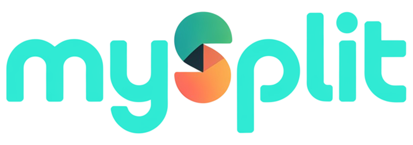

# MABESI MYSPLIT APP



**MySplit** is a mobile application built with React Native and Expo for splitting bills among friends and managing shared expenses. The app handles complex scenarios where not all members participate in every transaction, continuously calculating and displaying net balances for each participant after accounting for payments made.

## 📱 Features

- **Group Management**: Create and join groups using QR codes or invite links
- **Member Approval System**: Group owners can approve or reject pending members
- **Expense Tracking**: Add expenses with custom descriptions, amounts, and participant selection
- **Smart Balance Calculation**: Automatic calculation of who owes whom and how much
- **Payment Recording**: Track payments between members with automatic balance updates
- **Multi-language Support**: Available in English, Portuguese, and Spanish
- **Firebase Integration**: Real-time data synchronization with Firestore
- **Anonymous Authentication**: Secure user identification without requiring personal information
- **Responsive UI**: Beautiful gradient design with edge-to-edge display
- **QR Code Generation**: Easy group sharing via QR codes

## 🛠️ Technologies

- **React Native** (0.81.5) - Mobile app framework
- **Expo** (~54.0.25) - Development platform
- **TypeScript** (^5.9.3) - Type-safe development
- **Firebase** (^12.6.0) - Backend services
  - Firestore - Real-time database
  - Authentication - Anonymous auth
  - Storage - File storage
- **Expo Router** (~6.0.15) - Navigation
- **i18n-js** (^4.5.1) - Internationalization
- **AsyncStorage** (2.2.0) - Local data persistence
- **Google Mobile Ads** (^16.0.0) - Monetization

## 📋 Prerequisites

- Node.js (v16 or higher)
- npm or yarn
- Expo CLI
- Android Studio (for Android development) or Xcode (for iOS development)
- Firebase account

## 🚀 Installation

1. **Clone the repository**
```bash
git clone https://github.com/mabesi/MySplit.git
cd MySplit
```

2. **Install dependencies**
```bash
npm install
```

3. **Configure Firebase**
   - Create a new Firebase project at [Firebase Console](https://console.firebase.google.com/)
   - Enable Firestore Database
   - Enable Anonymous Authentication
   - Update `firebaseConfig.ts` with your Firebase credentials

4. **Configure Firestore Security Rules**
   - Deploy the security rules from `firestore.rules` to your Firebase project

5. **Start the development server**
```bash
npm start
```

6. **Run on your device**
   - Scan the QR code with Expo Go app (Android/iOS)
   - Or run on emulator:
     ```bash
     npm run android  # For Android
     npm run ios      # For iOS
     ```

## 📦 Building for Production

### Android APK (Preview Build)
```bash
eas build --platform android --profile preview
```

### Production Build
```bash
eas build --platform android --profile production
```

## 🔒 Firebase Security

The app uses Firebase Anonymous Authentication to secure user data. Each user gets a unique anonymous ID that is used to:
- Associate groups with their creators
- Track member participation in groups
- Secure expense and payment data

Firestore security rules ensure that:
- Only authenticated users can read/write data
- Users can only modify groups they own or are members of
- Expense and payment data is protected by group membership

## 📱 App Structure

```
MySplit/
├── app/                    # Expo Router pages
│   ├── index.tsx          # Home screen
│   ├── group/             # Group-related screens
│   ├── donate.tsx         # Donation screen
│   └── help.tsx           # Help screen
├── components/            # Reusable components
├── context/              # React Context providers
│   └── GroupContext.tsx  # Global state management
├── services/             # Firebase services
│   ├── groupService.ts   # Group operations
│   ├── expenseService.ts # Expense operations
│   └── paymentService.ts # Payment operations
├── i18n/                 # Internationalization
├── types/                # TypeScript type definitions
├── utils/                # Utility functions
└── assets/               # Images and icons
```

## 🌍 Internationalization

The app supports three languages:
- 🇺🇸 English
- 🇧🇷 Portuguese
- 🇪🇸 Spanish

Language can be changed from the home screen by tapping the flag icons.

## 🎨 Design Features

- **Dark Mode**: Sleek dark theme with gradient backgrounds
- **Edge-to-Edge Display**: Immersive full-screen experience
- **Responsive Layout**: Adapts to different screen sizes
- **Smooth Animations**: Enhanced user experience with transitions
- **Custom Icons**: Beautiful vector icons from Expo Vector Icons

## 📄 License

This project is licensed under the [MIT License](https://opensource.org/license/MIT).

## ⚠️ Disclaimer

The use of this tool, for any purpose, will occur at your own risk, being your sole responsibility for any legal implications arising from it.

It is also the end user's responsibility to know and obey all applicable local, state and federal laws. Developers take no responsibility and are not liable for any misuse or damage caused by this program.

## 👨‍💻 Author

**Plinio Mabesi**
- GitHub: [@mabesi](https://github.com/mabesi)
- Email: pliniomabesi@gmail.com

## 🤝 Contributing

Contributions, issues, and feature requests are welcome!

Feel free to check the [issues page](https://github.com/mabesi/MySplit/issues).

## ⭐ Show your support

Give a ⭐️ if this project helped you!

---

Made with ❤️ by Plinio Mabesi
